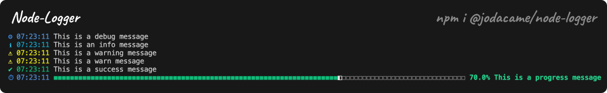

# node-logger
Simple logger for nodejs. 


## Installation
```bash
npm install @jodacame/node-logger
```

## Basic Usage
```javascript
const logger = require('@jodacame/node-logger');
or 
import logger from '@jodacame/node-logger';

logger.info('Hello world');
logger.error('Hello world');
logger.warn('Hello world');
logger.debug('Hello world');

logger.info('Hello world', { key: 'value' });
logger.error('Hello world', { key: 'value' });
logger.warn('Hello world', { key: 'value' });
logger.debug('Hello world', { key: 'value' });

```

## Stdout Usage
Allow to log to stdout

```javascript
const logger = require('@jodacame/node-logger');
or
import logger from '@jodacame/node-logger';

logger.stdout.info('Hello world');
logger.stdout.error('Hello world');
logger.stdout.warn('Hello world');
logger.stdout.debug('Hello world');

logger.stdout.info('Hello world', { key: 'value' });
logger.stdout.error('Hello world', { key: 'value' });
logger.stdout.warn('Hello world', { key: 'value' });
logger.stdout.debug('Hello world', { key: 'value' });

```

## Progress Usage
Display progress bar

```javascript
const logger = require('@jodacame/node-logger');
or
import logger from '@jodacame/node-logger';

logger.progress(value, [total], [barLength], [message]);

// Example:
logger.progress(50, 100, 100, 'Progress bar');
logger.progress(70);

```

## Types of log
- info
- error
- warn
- debug
- progress
- stdout[info, error, warn, debug, progress]


